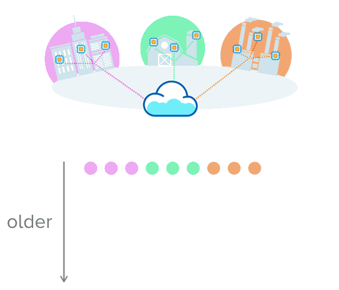

```{r setup, include=FALSE}
knitr::opts_chunk$set(echo = TRUE)
```


```{r, echo=FALSE, message=FALSE}
library(tidyverse)
library(forecast)
library(rprojroot)
library(fs)
```

## Setup Guide

 1. Install R 3.5: https://cran.r-project.org/
 2. Install RStudio Desktop (Free): https://www.rstudio.com/products/rstudio/download/#download
 3. Download and extract the code to this talk: https://github.com/xinbinhuang/r-time-series/archive/master.zip
 4. Click on the .Rproj file
 5. `packrat::restore()`

## Who Am I?

- Alumni of the UBC Master of Data Science Program
- Co-organizer of School of AI
- Data Scientist at LiveStories

## Acknowledgements

 - This workshop is adapted from [Forecasting: Principles and Practice](https://otexts.com/fpp2/). An accompanjed book for the amazing `forecast` package by *Rob J Hyndman*.
 
## Why R? (not Python sorry)

- R with Statistical Analysis in mind.
- A lot of packages/models in R that Python simply doesn't have.
- CRAN [Time Series Task View](https://cran.r-project.org/web/views/TimeSeries.html)

## What is Time Series?

- Data recorded in time order 
- Time as the primary axis



## Why should I care?

- Economic forecasting
- Target setting
- Budget/inventory management
- Sensors

## How do we do Time Series Analysis?


## The Dataset

## EDA & Processing

<aside class="notes">EDA : Exploratory Data Analysis</aside>


## Model Fitting

## Models

## Model Validation

- Time-series train-test split
- Time-series cross-validation

## Forecasting!!!

<aside class="notes">Also called extrapolation.</aside>


## 