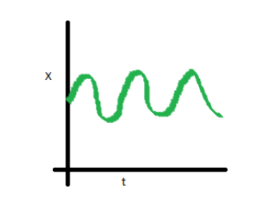

```{r setup, include=FALSE}
knitr::opts_chunk$set(echo = TRUE)
```


```{r, echo=FALSE, message=FALSE}
library(zoo)
library(tidyverse)
library(forecast)
library(prophet)
theme_set(theme_bw())
```

## Setup Guide

 1. Install R 3.5: https://cran.r-project.org/
 2. Install RStudio Desktop (Free): https://www.rstudio.com/products/rstudio/download/#download
 3. Download and extract the code to this talk: https://github.com/xinbinhuang/r-time-series/archive/master.zip
 4. Click on the .Rproj file
 5. `packrat::restore()`

## Who Am I?

- Alumni of the UBC Master of Data Science Program
- Co-organizer of School of AI
- Data Scientist at LiveStories

## Acknowledgements

 - This workshop is adapted from [Forecasting: Principles and Practice](https://otexts.com/fpp2/). An accompanjed book for the amazing `forecast` package by *Rob J Hyndman*.
 - [Prophet](https://github.com/facebook/prophet): A robust forecasting framework by Facebook.
 
## Why R? (not Python sorry)

- R with Statistical Analysis in mind.
- A lot of packages/models in R that Python simply doesn't have.
- CRAN [Time Series Task View](https://cran.r-project.org/web/views/TimeSeries.html)

## What is Time Series?

- Data recorded in time order 
- Time as the primary axis


## Why should I care?

- Economic forecasting
- Target setting
- Budget/inventory management
- Sensors
- Monitoring/Log data
- ...

## How do we do Time Series Analysis?

- Exploratory Data Analysis (EDA) to check if the data is staionary
- Transform the data if needed
    - Box-Cox Transformation
- Model Selection & Validation
- Forecasting

## "Jargons"

- **Trend**: a long-term increase or decrease in the data.
- **Seasonality**: a periodic pattern over a fixed period
- **Cyclic**: rises and falls that are not of a fixed frequency. 
- **Stationary**: properties do not vary across time

<aside class="notes">
<p>Cyclic does not have fixed frequency but Seasonality does</p>
<p>Stationary: Constant mean and variance</p>
</aside>

## Stionary or NOT

#### Non-staionary


<aside class='notes'>Trend, Seasonality, Varying covariance/correlation</aside>

#### Stationary


## The Dataset

- Time series version of the *Titanic Dataset*
- Airline Passanger 
    -  Monthly totals of international airline passengers, 1949 to 1960.

```{r}
head(AirPassengers, 12)
```


## EDA & Processing

```{r}
AirPassengers %>% tsdisplay()
```

<aside class="notes">
<p>ACF: autocorrelation function. Does what happen yesterdaty have a impact on today?</p>
<p>PACF: partial autocorrelation function. Does what happend last week have a direct impact on today? Excluding the impacts between today and last week.</p>
<p>Need to tranform it to make it stionary</p>
</aside>

## Decomposition

```{r}
AirPassengers %>% 
    stl(s.window = 'periodic') %>% 
    autoplot()
```

<aside class="notes">Decompose the series to look at the patterns of the data</aside>

## Model Fitting

- Time-series train-test split
- *Time-series cross-validation*

```{r}
# keep the last year as test set
train <- window(AirPassengers, end=1959+11/12)
test <- window(AirPassengers, start=1960)
```

<aside class="notes">Here we don't use cross-validation. But cross-validation is especially good for small data set.</aside>

## Models

- Linear regression
- ARIMA
- Exponential smoothing

```{r}
# try different hyperparameters!

# linear regression
mod1 <- tslm(train ~ trend + season) 
# ARIMA
mod2 <- auto.arima(train) 
# exponential smoothing
mod3 <- hw(train, seasonal = 'multiplicative') 
```

<aside class="notes">You may want to tune some hyperparameters to better fit the data.</aside>

## Model Validation

- Make predictions on the test set
- Validate model performance with the test set
- *Don't use training set to validate your model performance*
    - **OVERFITTING**

```{r}
h <- length(test)

# benchmark prediction: use value in the previous period
benchmark <- naive(train, h=h) 

mods <- list(
    lm = mod1,
    arima = mod2,
    exp_smooth = mod3
)
# make predictions on test set
preds <- map(mods, ~ forecast(.x, h=h))

```

<aside class="notes">
<p>In time series, it is important to have benchmark methods, cuz sometimes those naive methods would outperform complex models.</p>
<p>Overfitting: memorize the training set without actually learning the underlying pattern.</p>
</aside>

## Validation

- Use score metric to compare models

```{r}
# RMSE score for comparison
accuracy(benchmark, test)[, 'RMSE']
map(preds, ~ accuracy(.x ,test, h=h)[, 'RMSE'])
```

<aside class="notes">There are different metrics for comparisons.</aside>

## How do they look on a plot?

```{r, echo=FALSE}
autoplot(AirPassengers, series = 'Observed') +
    autolayer(benchmark$mean, series = 'Naive') +
    autolayer(preds$lm$mean, series = 'Linear regression') +
    autolayer(preds$arima$mean, series = 'ARIMA') +
    autolayer(preds$exp_smooth$mean, series = 'Exp Smoothing') +
    theme(legend.position = 'top') +
    ggtitle('Air Passangers Prediction')
```


## Forecasting!!!

```{r}
# train on the whole data set
final_mod <- hw(AirPassengers, seasonal = 'multiplicative')

# let's have a 3 year future forecast
h <- 12 * 3

fc <- forecast(final_mod, h)
```

<aside class="notes">Remember to have your final model to train on the whole data set.</aside>

## Forecast plot

```{r, echo=FALSE}
fc %>% autoplot()
```

## Prophet 

- A robust forecasting framework by Facebook Data Science team
- Best with strong seasonal effects and several seasons of historical data.
- Robust to missing data, outliers, and shift in trend

```{r, message=FALSE}
format_ts <- function(ts) {
    ds <- as.Date(zoo::as.yearmon(time(ts)))
    y <- as.matrix(ts)
    return(data.frame(ds = ds, y = y))
}

air_passengers <- format_ts(train) # format the input as required by Prophet

# fitting 
mod4 <- prophet(air_passengers, seasonality.mode = "multiplicative")
```

<aside class='notes'>based on an additive model where non-linear trends are fit with yearly, weekly, and daily seasonality, plus holiday effects.</aside>

## Prophet - Validation
```{r}
future <- make_future_dataframe(mod4, 
                                periods = 12, 
                                freq = 'month')
forecast <- predict(mod4, future)

yhat <- forecast$yhat[133:144] # subtract test set period
rmse <- sqrt(mean(yhat - test)^2 ) # calculate RMSE score
paste('RMSE: ', rmse)
```

<aside class="notes">RMSE even lower than previous models</aside>

## Train on the whole set and Forecast

```{r, message=FALSE}
air_passengers <- format_ts(AirPassengers)

prophet_mod <- prophet(air_passengers, seasonality.mode = "multiplicative")
future <- make_future_dataframe(prophet_mod, 
                                periods = 12, 
                                freq = 'month')
forecast <- predict(prophet_mod, future)
```

## Forecast Plot
```{r}
dyplot.prophet(prophet_mod, forecast)
```

## Other stuff??

- Tune hyperparameters for your data
- Python? (i.e. `statsmodels`)
- Feature engineering 
- Tree-based algorithm (i.e. LightGBM)
- Deep Learning (i.e. LSTM)